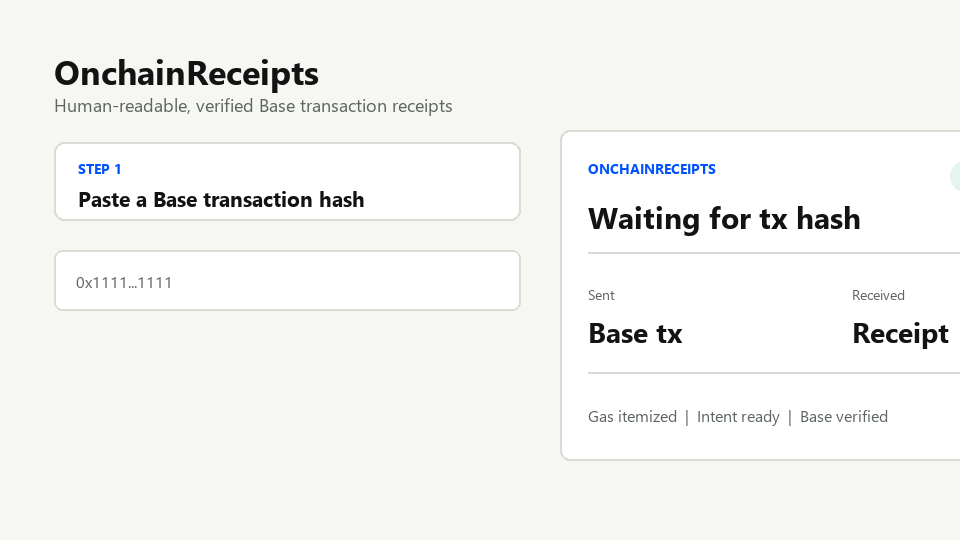

# TxReceipts

Onchain pre-accounting for Base wallets.

TxReceipts is not a block explorer.

TxReceipts is a pre-accounting workspace for onchain wallets. It turns wallet activity into categorized ledger rows, printable receipts, monthly reports, and export-ready accounting outputs. The goal is to help users, teams, dapps, and accountants understand income, expenses, swaps, gas fees, app fees, protocol fees, subscriptions, and uncategorized rows without reading explorer logs.

## Why this exists

Block explorers are precise, but most people cannot turn raw logs, internal calls, router paths, gas fields, and token transfers into monthly bookkeeping. Wallet previews help before signing, but after the transaction users still need records that an accountant can review.

## Product shape

1. Hero: Onchain pre-accounting for Base wallets.
2. Problem: Explorers are not accounting tools.
3. Product: Wallet ledger plus receipts plus monthly reports.
4. Demo: Connect wallet or paste tx hash.
5. Ready questions: Gas, spend, income, top dapp, uncategorized, fees, subscriptions, largest expenses.
6. AI layer: Optional assistant, template-first.
7. Dapp API: Add business context to transactions.
8. Security: Read-only, no approvals, no private keys.
9. Exports: CSV, PDF, printable notes.
10. Open-source and Base-first.

TxReceipts is designed for:

- Users who want a monthly wallet activity report for Base.
- Accountants who need incoming, outgoing, fee, token, and review rows without reading explorer logs.
- Dapps that want to attach business context after swaps, mints, payments, subscriptions, games, and creator support.
- Builders who need a shared schema for transaction intent, actual onchain outcome, fee breakdowns, and printable transaction notes.

## What makes it different

There are already products that make transaction hashes more readable. TxReceipts focuses on a more practical accounting primitive:

**Intent plus verification.**

A dapp can send intent metadata after a transaction:

- what the user intended to do
- expected input and output assets
- app fee, protocol fee, merchant, category, and accounting note
- app identity and branding

The accounting verification engine then checks Base onchain data:

- transaction success
- sender and recipient relationships
- ERC-20 transfers
- gas paid
- observed fees
- whether the actual result matches the submitted intent

The output is an accounting-ready record. A short printable receipt can also be generated for a selected transaction.

## Launch scope

V1 is intentionally narrow:

- Base mainnet first, with experimental multi-network lookup in the demo
- wallet-connected pre-accounting inbox
- wallet ledger with income, expense, swap, transfer, gas fee, app fee, protocol fee, subscription, and uncategorized rows
- short printable transaction note from transaction hash
- monthly summary and accountant-ready report
- Excel-readable CSV wallet report export
- print-to-PDF wallet accounting report
- deterministic ready-question assistant for accounting questions
- server-side AI fallback only when template answers do not fit
- pre-accounting panel with selected-network review counts and export readiness
- open accounting receipt schema and dapp intent schema
- read-only MCP package for wallet analysis, not transaction execution

V2 adds:

- developer API keys
- verified dapp receipts
- webhooks
- branded receipts
- CSV exports
- optional daily receipt hash anchoring on Base

## Repository map

```txt
apps/web/          Static product prototype and receipt renderer
apps/api/          Cloudflare Worker API draft for credits, top-ups, and receipt usage
docs/              Research, product design, security, pricing
schema/            Receipt and dapp intent JSON schemas
examples/          Sample receipt payloads
packages/engine/   Planned parser and verification engine
packages/sdk/      Dapp SDK draft
packages/mcp-server/ Read-only MCP server package for wallet, tx, and receipt tools
```

## Current prototype

Open `apps/web/index.html` in a browser. The first prototype is dependency-free so the project can be reviewed without a build step.

Live demo:

https://madmin27.github.io/OnchainReceipts/

## Demo walkthrough



The first live demo connects to wallet activity, separates incoming and outgoing rows, highlights records needing review, and prepares CSV or print-to-PDF accounting output. A selected transaction can also produce a short printable receipt note with token movement, status, and gas paid.

### Video

[](https://www.youtube.com/watch?v=-gd716Yo8O4)

Watch the TxReceipts overview on YouTube.

## Why not just a block explorer?

Block explorers are essential, but they are optimized for technical inspection. Most users still have to interpret raw logs, token movements, router contracts, internal calls, gas fields, and contract labels by themselves.

TxReceipts is designed for a different job:

- turn wallet activity into accounting-friendly records
- separate sent assets, received assets, gas, app fees, and protocol fees
- let dapps submit intent metadata that can be checked against observed onchain results
- produce CSV, PDF, and short printable transaction outputs
- give users a monthly bookkeeping workspace rather than a list of hashes

The core question is not only "what happened onchain?" It is "what is income, what is expense, what needs review, and can the user hand this to accounting?"

## AI assistant layer

The accounting engine stays first. Base MCP now exists as a read-only package for questions like "what did I spend USDC on this month?" or "which creator payments did I receive?" rather than as the canonical verification backend.

The current prototype uses a zero-token assistant pattern:

- ready-question buttons for common wallet accounting questions;
- Turkish and English keyword routing before any AI call;
- template answers for gas fees, app fees, protocol fees, subscriptions, largest expenses, uncategorized rows, and export actions;
- selected-network scope, so answers focus only on the connected network's loaded data;
- local logging of AI questions as future ready-question candidates;
- AI fallback preserved as a controlled server-side layer for questions that templates cannot answer.

See [docs/ai-assistant.md](docs/ai-assistant.md).

The accounting MCP plan is documented in [docs/accounting-mcp.md](docs/accounting-mcp.md), and the first package implementation lives in [packages/mcp-server](packages/mcp-server). MCP should act as a selected-network data collection layer, while reports remain deterministic and template-first. AI can stay in the product as a fallback and learning layer, but it should receive only compact accounting context.

## How dapps integrate

Dapps can integrate by submitting intent metadata after a Base transaction lands. The API verifies the transaction against Base onchain data before issuing a receipt. The SDK draft lives in [packages/sdk](packages/sdk), and the credit/billing design lives in [docs/sdk-billing.md](docs/sdk-billing.md).

```ts
import { TxReceipts } from '@txreceipts/sdk';

const receipts = new TxReceipts({
  apiKey: process.env.TX_RECEIPTS_API_KEY,
  projectId: 'example-swap',
});

const receipt = await receipts.createReceipt({
  chainId: 8453,
  txHash: '0x...',
  ownerWallet: '0x...',
  intent: {
    type: 'swap',
    summary: 'Swap 25 USDC for ETH',
    sent: [{ symbol: 'USDC', amount: '25.00' }],
    received: [{ symbol: 'ETH', amount: '0.0068' }],
    fees: [{ type: 'app', symbol: 'USDC', amount: '0.03' }],
  },
  merchant: {
    name: 'ExampleSwap',
    reference: 'swap_123',
  },
});
```

The verification engine returns a `verified`, `partial`, `mismatch`, or `failed` status with downloadable artifacts, machine-readable checks, and credit accounting details. Receipt IDs are deterministic and derived from `chainId + txHash + ownerWallet`, so the same wallet and transaction always regenerate the same `TxReceipts Receipt ID`.

## Payments and tx credits

Dapp credits start as prepaid native USDC on Base. A project can register billing wallets, send USDC to the TxReceipts treasury wallet, and receive credits after the transfer is confirmed and reconciled.

The launch rule is simple:

```txt
first 1,000 API requests are free
1 USDC = 2,000 additional API requests
minimum top-up: 5 USDC
```

See [docs/usdc-payments.md](docs/usdc-payments.md) and [docs/sdk-billing.md](docs/sdk-billing.md).

The backend deployment path is documented in [docs/backend-deployment.md](docs/backend-deployment.md). The API draft uses Cloudflare Workers and D1 to automate project request balances, Base USDC top-ups, scheduled payment confirmation, and receipt API usage.

## Security posture

TxReceipts should never ask for private keys, seed phrases, token approvals, or spending permissions. Wallet signatures are only for login/session ownership. Receipt generation reads public Base data and optionally accepts signed dapp intent metadata.

See [docs/security-model.md](docs/security-model.md).

## License

MIT. See [LICENSE](LICENSE).

## Deployment note

The web app prefers `https://api.txreceipts.com.tr` and keeps a browser-side fallback to `https://txreceipts-api.evpc77.workers.dev` for resilience while DNS and mobile wallet routing settle.

If you integrate with the SDK or scripts, set `baseUrl` explicitly when you need to pin a specific endpoint during rollout.
